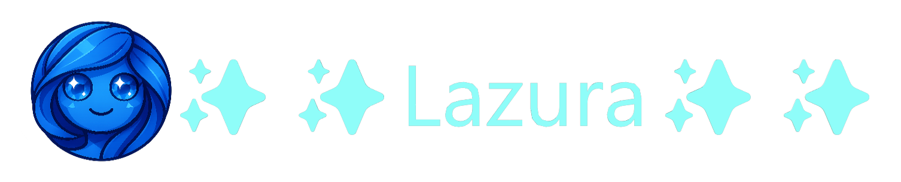

---

## Overview

Lazura Desktop is a lightweight, modern browser built on Electron. While its feature set is minimal, it provides a clean and straightforward browsing experience with support for multiple tabs and basic search functionality.

Designed with simplicity and performance in mind, Lazura Desktop is an ideal starting point for users who want a no-frills Electron-based browser that won’t weigh down system resources.

since this project is open source, it is a good starting point for anyone who wihes to build an electron based browser.
---

## Features

- **Electron-based**: Built on the powerful Electron framework for cross-platform desktop applications.
- **Tabbed Browsing**: Manage multiple web pages with ease through a clean tab interface.
- **Lightweight**: Minimal footprint designed for speed and efficiency.
- **Search Capability**: Quickly search the web directly from the browser.
- **Built with TypeScript & React**: Leveraging modern technologies for a robust and maintainable codebase.

---

## Getting Started

download the latest version of node.js from her: https://nodejs.org/en/download

Enable Corepack:

```bash
corepack enable
```

Clone the repository and install dependencies:

```bash
git clone https://github.com/VQMSoftware/Lazura-desktop
cd Lazura-desktop
yarn install
```

Create a production build:

```bash
yarn run build
```

---

### Development

Run the app in development mode:

```bash
yarn run dev
```

---

## Contributor License Agreement 🔒

Before contributing, all developers must read and agree to the [(contributing license agreement)](CONTRIBUTING.md).

By submitting code, you confirm that:
+ you have read the agreement in its entire form, no shortcuts, no exeptions.

Pull requests that do not include explicit CLA agreement will be closed.

---

## Future Plans

Lazura Desktop is a work in progress. Upcoming improvements may include enhanced feature sets, UI/UX refinements, and performance optimizations.

---

## License

This project is licensed under [](LICENSE)
